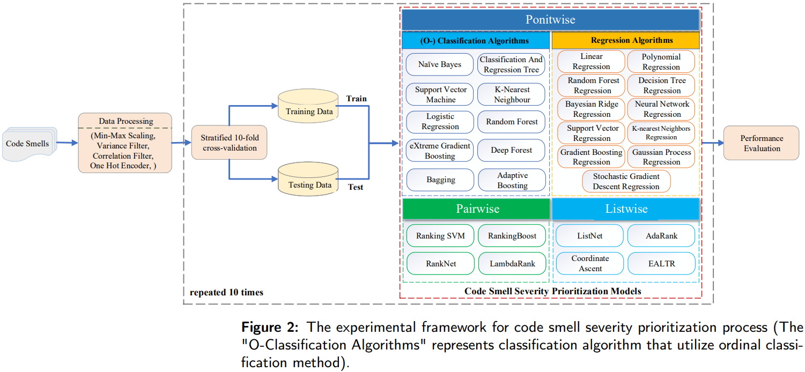

# Revisiting Code Smell Severity Prioritization Using Learning to Rank Techniques
This is the source code of the paper **"Revisiting Code Smell Severity Prioritization Using Learning to Rank Techniques"**. This repository includes the dataset used in our work, the source code for algorithm execution, data processing, and the final experimental result data.

## Summary
We make a comprehensive comparison of 31 pointwise, 4 pairwise, and 4 listwise learning to rank algorithms for code smell severity prioritization on four severity datasets. 
Furthermore, we propose the adoption of Severity@20\% and Cumulative Lift Chart (CLC) as the primary evaluation metrics to assess severity prioritization models more effectively. 




The results show that:
- (1) The ordinal Bagging (O-Bagging) algorithm demonstrates the best performance in code smell severity prioritization, achieving superior results in terms of Severity@20\% and CLC.
- (2) The ordinal classification method can help the best-performing base classification algorithms Bagging and XGBoost achieve better performance in severity prioritization tasks.
- (3) A higher (lower) Accuracy, higher (lower) Spearman, and lower (higher) MAE do not reliably indicate better (worse) performance for Severity prioritization. This further underscores that Accuracy, Spearman, and MAE are unsuitable metrics for evaluating severity prioritization models' effectiveness. 

In summary, we recommend that software developers employ the O-Bagging algorithm to prioritize the code smell severity and use Severity@20\% and CLC as the primary evaluation metrics.

## Usage
```Main.py``` is entry point for script execution. The experimental execution flow of the entire code is as follows:
```python
    # Run model and get experimental results
    for data_type, path in cf.datasets_location.items():
            process_data(path, data_type, "")
    # Calculate the average value and replace NaN values.
    cal_all(cf.origin_results_path, "median")
    # 1. Convert the generated data into comparative data.
    transform_result(cf.origin_results_path, cf.transform_path)
    # 2. Convert the data into median or mean values for heat.
    gen_heat_result("median")
    # 3. Generate a PDF for the heat.
    do_draw("median")
    # 4. Execute the generated comparative data in R language (in R IDE).
    # 5. Generate SK-ESD results.
    gen_skesd()
    # # 6. Generate a PDF for SK-ESD.
    do_draw("skesd")
```

> Note: The calculation of the Wilcoxon test and cliff value is performed separately in the code file ```Wilcoxon_pvalue_cliff.py```.

> Note: Please double-check if the input and output paths are correctly configured.
### Folder details
- [datasets](./datasets): The four code smell severity datasets we used.
- [predication](./prediction): The direct storage location for the model's running results.
- [empirical_results](./emprical_results): The storage location for the processed experimental data, including median values, skewness values, and statistical test values.
- [RCode](./RCode): The R script we run for SKESD test. Note that it should be executed in the R environment.
- [dat_file](./dat_file), [model](./model), [test_result](./test_result): The intermediate generated split datasets, models, and test results when executing the 6 models in pairlist and wiselist.

### File details
- [CalculateResultMean.py](./CalculateResultMean.py), [GetMedianComparisonResults.py](./GetMedianComparisonResults.py), [TransformResultToComparsion.py](./TransformResultToComparsion.py): Processed result data.
- [Configuration.py](./Configuration.py): Specify the path configuration for the entire project.
- [LinearLTR.py](./LinearLTR.py): The implementation of the EALTR method.
- [SimpleReinforcementMethod.py](./SimpleReinforcementMethod.py): The implementation of the ordinal classification method.
- [RankSVM.py](./RankSVM.py): The implementation of the RankSVM algorithm.
- [rankboostYin.py](./rankboostYin.py): The process of implementing the 6 pairwise and listwise algorithms by calling the ```RankLib.jar``` package.
- [heat_map_pic.py](./heat_map_pic.py): Draw heatmaps.
- [SKESD_test.py](./SKESD_test.py): Process SKESD data.
- [Wilcoxon_pvalue_cliff.py](./Wilcoxon_pvalue_cliff.py): The calculation of the Wilcoxon test and cliff value.

## Citation

